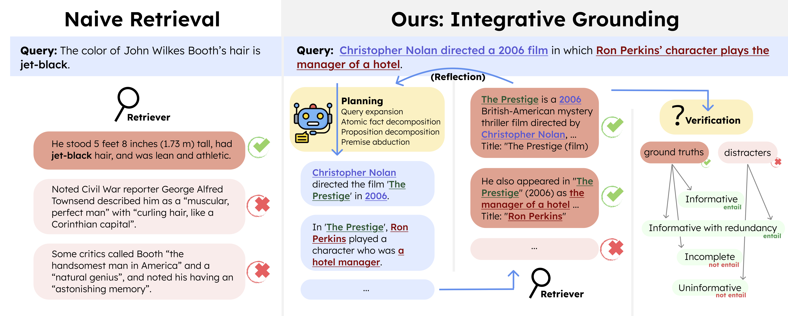

# InteGround: On the Evaluation of Verification and Retrieval Planning in Integrative Grounding

This is the official repo for the paper **InteGround: On the Evaluation of Verification and Retrieval Planning in Integrative Grounding** [[Arxiv]]().
<div style="width:100%; text-align:center;">
    <figure >
        
    </figure>
</div>


## Reproduce the results
To enable prompting with LLMs, you need to implement the method `get_llm_response()` in `utils.py` first.

For accessing the datasets we used, please refer to `data.py/get_datasets()`.
#### Groundedness verification
Please refer to the entry script
```bash
python launcher_verification.py
```

#### Retrieval planning for integrative grounding
Please refer to the entry script
```bash
python launcher_planning.py
```

## Bugs or questions?

If you have any questions, please feel free to send an email to `jchengaj@cse.ust.hk`.


## Citation

```bibtex
```
